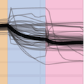

	
		
	

	

		

			
			
			
			

				

					Automatic generation of evolutionary hypotheses using mixed Gaussian phylogenetic models
				

				

				

					Mitov V, Bartoszek K, Stadler T.
					2019.
					PNAS vol. 116 no. 34 16921-16926.
				

			

		

	

	

		

		

			
			

				PDF
			

			

				

				<i class="fa fa-file-text-o fa-fw"></i>
				<a class="off" href="/publications/2019-mgpm-pnas/mitov-mgpm-mammals.pdf">mitov-mgpm-mammals.pdf</a>
			

			

				

				<i class="fa fa-file-text-o fa-fw"></i>
				<a class="off" href="/publications/2019-mgpm-pnas/mitov-mgpm-mammals-sapp.pdf">mitov-mgpm-mammals-sapp.pdf</a>
			

			
			

			
			
			
			

				DOI
			

			

				

				<i class="fa fa-external-link fa-fw"></i>
				<a class="off" href="https://doi.org/10.1073/pnas.1813823116">10.1073/pnas.1813823116</a>
			

			

			
			
			

				GitHub
			

			

				

				<i class="fa fa-github-alt fa-fw"></i>
				<a class="off" href="http://github.com/venelin/PCMFit">PCMFit</a>
			

			

				

				<i class="fa fa-github-alt fa-fw"></i>
				<a class="off" href="http://github.com/venelin/MGPMMammals">MGPMMammals</a>
			

			

				

				<i class="fa fa-github-alt fa-fw"></i>
				<a class="off" href="http://github.com/venelin/MGPMSimulations">MGPMSimulations</a>
			

			

			
		

	

	

		

			<h1>Abstract</h1>

Phylogenetic comparative methods are widely used to understand and quantify the evolution of phenotypic traits, based on phylogenetic trees and trait measurements of extant species. Such analyses depend crucially on the underlying model. Gaussian phylogenetic models like Brownian motion and Ornstein–Uhlenbeck processes are the workhorses of modeling continuous-trait evolution. However, these models fit poorly to big trees, because they neglect the heterogeneity of the evolutionary process in different lineages of the tree. Previous works have addressed this issue by introducing shifts in the evolutionary model occurring at inferred points in the tree. However, for computational reasons, in all current implementations, these shifts are “intramodel,” meaning that they allow jumps in 1 or 2 model parameters, keeping all other parameters “global” for the entire tree. There is no biological reason to restrict a shift to a single model parameter or, even, to a single type of model. Mixed Gaussian phylogenetic models (MGPMs) incorporate the idea of jointly inferring different types of Gaussian models associated with different parts of the tree. Here, we propose an approximate maximum-likelihood method for fitting MGPMs to comparative data comprising possibly incomplete measurements for several traits from extant and extinct phylogenetically linked species. We applied the method to the largest published tree of mammal species with body- and brain- mass measurements, showing strong statistical support for an MGPM with 12 distinct evolutionary regimes. Based on this result, we state a hypothesis for the evolution of the brain–body-mass allometry over the past 160 million y.

		

	

	

	
	
